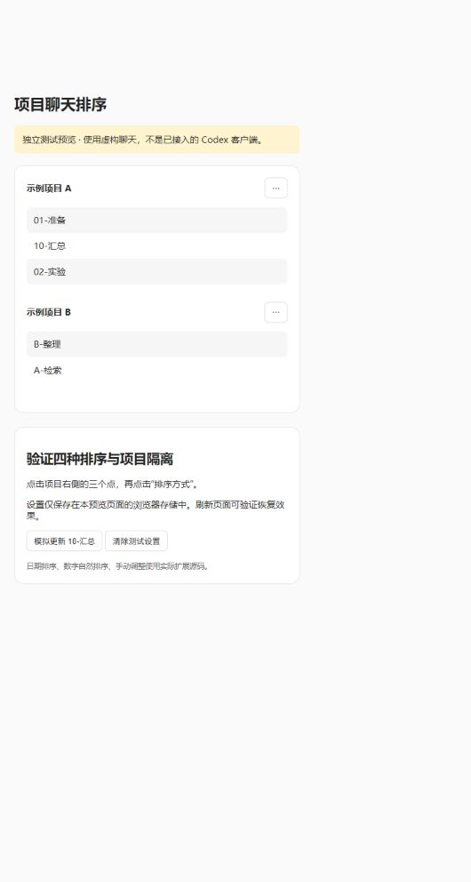

# Codex Project Chat Sort

**实验性社区扩展，0.1.0-alpha.1。尚未验证在正式 Codex 客户端加载成功，不是安装即用的官方插件。**

为项目三点菜单增加 **排序方式 → 最近更新 / 创建日期 / 名称 / 手动**，按账号、来源、主机与项目 ID 分别保存配置。

[English](README.en.md) · [验证记录](docs/VALIDATION.md) · [已有项目调查](docs/RESEARCH.md) · [功能建议](https://github.com/openai/codex/issues/48910)

## 已实现

- 日期升降序、中文与数字自然名称排序；缺失日期始终置后。
- 每个项目独立配置；适配层复用客户端的持久化偏好机制。
- 手动模式保留当前顺序；独立调整窗口提供上移、下移、拖动、保存、取消。
- 恢复应用默认排序，不改动原来的全局排序设置。
- 源码指纹不匹配时拒绝注入，原始脚本继续加载。
- 不修改安装目录、不改写 ASAR、不读取令牌、不上传聊天。仓库不包含客户端二进制或完整编译产物。

## 当前限制（请先读）

| 项目 | 状态 |
| --- | --- |
| 核心排序、项目隔离、菜单模型、注入响应逻辑 | 自动化测试通过 |
| 独立浏览器预览：排序、手动调整、刷新恢复 | 已通过交互验证，使用虚构数据 |
| 编译脚本适配 | 仅识别 app 26.924.22138 / Windows 包 26.924.2738.0 的精确 SHA-256 |
| Windows 正式客户端端到端运行 | **未验证**：本机隔离启动被系统拒绝访问 |
| 普通 Codex 插件市场安装 | 不支持；这是非官方界面扩展 |
| 支持范围 | 适配本地/远程项目菜单；仅对客户端已加载的聊天排序 |
| 分页、未加载历史 | 不会主动拉取；不承诺完整历史的全局排序 |
| 置顶项目、ChatGPT 云项目菜单 | 此版本不提供适配；全局置顶聊天不改动 |
| 手动模式 | 使用插件的调整窗口；未接管客户端原生拖动 |
| 多窗口与重启 | 依赖宿主偏好存储；正式客户端尚未实测 |

## 先试预览（不需要登录）

需要 Node.js 22 或更高版本，没有第三方运行依赖。

```sh
git clone https://github.com/syj3426962511-glitch/codex-project-chat-sort.git
cd codex-project-chat-sort
node --test test/*.test.mjs
node tools/preview.mjs
```

在浏览器打开 `http://127.0.0.1:9438`。预览明确标记为测试页面；它不连接真实 Codex 聊天。



## 实验性宿主接入

此流程面向扩展开发者，**不承诺当前 Windows Store 版本可启动调试端口**。

1. 只读核验你自己的安装包（不会修改文件）：

   ```sh
   node bin/cli.mjs doctor --asar "PATH/TO/resources/app.asar"
   ```

2. 在单独的测试实例中启用仅限回环地址的 Chromium 调试端口。不要暴露给局域网或公网；调试端口允许控制该实例。仓库提供 `tools/Start-IsolatedProbe.ps1`（PowerShell 7.4+）用于尝试启动独立配置与独立 `CODEX_HOME`；它在本机 Store 版本返回了拒绝访问。遇到这个错误应停止，不改变 WindowsApps ACL、不关闭保护、不替换正式客户端。

3. 若你的测试实例确实提供 CDP，选择准确的页面 ID：

   ```sh
   node bin/cli.mjs list --port 9437
   node bin/cli.mjs attach --port 9437 --target PAGE_ID
   ```

4. 附加后手动刷新测试页面；或使用 `--reload` 明确请求刷新。**刷新可能中断该页面的操作，勿在进行中的工作窗口使用。**

CLI 只替换内存中的单个已知脚本响应。`renderer-patched` 只说明响应替换成功，仍需验证菜单、数据、持久化和分页行为。关闭客户端后不会自动重新加载扩展；此版本没有自启动安装器。

## 撤销

在菜单选择“恢复应用默认排序”清除该项目覆盖。停止注入 CLI，再重新加载测试客户端，恢复原始界面代码。即使保留社区扩展的偏好键，原始客户端不会使用它。不会删除会话、项目、原生排序配置或安装文件。

## 开发与兼容性

`src/core.mjs` 是纯排序逻辑，`src/addon.mjs` 构建菜单与项目状态，`src/renderer-adapter.js` 是版本绑定的宿主适配，`src/intercept.mjs` 处理 CDP 响应。`profiles/` 保存指纹和少量替换锚点。

适配新版本前必须重新检查宿主符号、线程时间单位、菜单结构、响应拦截能力，并补充实机验证。不要简单删除指纹检查。`.runtime/` 和 `.artifacts/` 不应提交，其中可能包含本地测试数据或私有客户端代码。

独立社区项目，与 OpenAI 无隶属或背书关系。项目原创代码使用 MIT 许可；Codex 客户端及其他项目保持各自权利。
